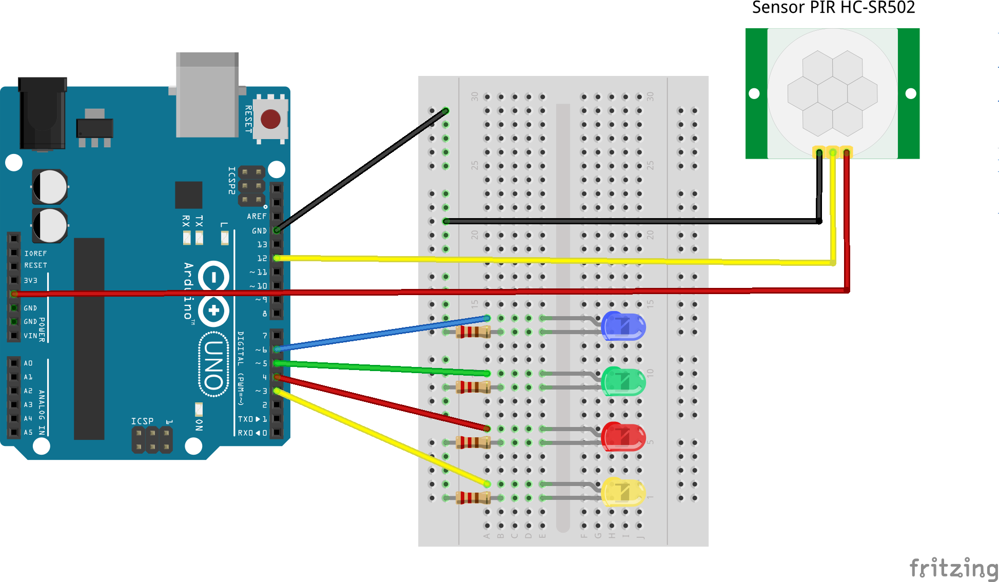

# Playing around with FreeRTOS and Arduino, directly in C

# Compiling
To make this project compilable you need first to download the version 10.0.0 of FreeRTOS. Then place it in the lib folder and put back the ATMega328 port in its folder. Check that the path you obtain is similar to the one already used for the port.

Then you can build the project with :

    > make

And upload it to the arduino with :

    > make program

In order to see it working, you need to make some wiring, for this follow this diagram :

# External information
- [FreeRTOS download](https://www.freertos.org/a00104.html)
- [Some help to port FreeRTOS on ATMega328](https://www.idreammicro.com/post/FreeRTOS-sur-ATmega328) (in french)
- [Electronic diagram drawing tool](http://fritzing.org/home/)